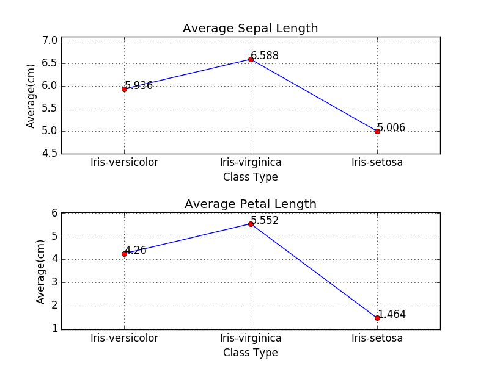

# Analysis Data

This is the program take the csv file that contain the sepal length, sepal width, petal length, petal width, class. It outputs the average sepal length and petal length with a plotted graph


# Geting Start

The program uses the Python3 to process all the data, to install Python3:
```
	$ sudo apt-get update
	$ sudo apt-get install python3.6
```

To make sure the python-matplotlib is installed:
```
	$ sudo apt-get install python-matplotlib
```

To run the program and get the graph, type below in the terminal:
```
	$ python3.5 main.py <your-csv-file>
```

in default, the program would use the data in `data.csv`, as user does not input csv file:
```
	$ python3.5 main.py
```
And output image would like:



# Function

Below are the detail of each function

---

## do_polt(file_name: str):

The function take the user input calls all functions below to process the data in csv file and output the png for the user

---

## read_csv_file(file_name: str) -> List[List[str]]:

function would take the arg in the terminal and open it for the function `parse_csv_data`

---

## parse_csv_data(data:List[List[str]]) -> dict:

function read line by line throughout the file and put the required data into the dictionary. the key of dictionary is the class of the flower. The format of scv must follow below:


	| sepal_length | sepal_width | petal_length | petal_width | class |
	|--------------|-------------|--------------|-------------|-------|
	| 	  float    |    float    | 	   float    | 	  float   |  str  |

	- Attribute 1: sepal length in cm
	- Attribute 2: sepal width in cm
	- Attribute 3: petal length in cm
	- Attribute 4: petal width in cm
	- Attribute 5: class:
		-- Iris Setosa
      	-- Iris Versicolour
      	-- Iris Virginica

### Error Shooting:

If the csv is not contain the correct type above, the program would raise the error `csv file has wrong format, please check the readme!`

---

## parse_csv_data_adv(data:List[List[str]]) -> dict:

This function is advanced for not only limit the three class above. If you want to calculate other classes data. please use this function

### Error Shooting:

If the csv is not contain the correct type above, the program would raise the error `csv file has wrong format, please check the readme!`

---

## proccess_data(data:dict) -> (List[float], List[float], List[str]):

Function takes the analysised data.It calculate and return the array containning the average of sepal length, petal length and corresponding to each class

---

## plot_graph(sepal_arr:List[float], petal_arr:List[float], class_arr:List[str]):

Function using `python-matplotlib` to plot the graph and output png file called `data.png`

---


